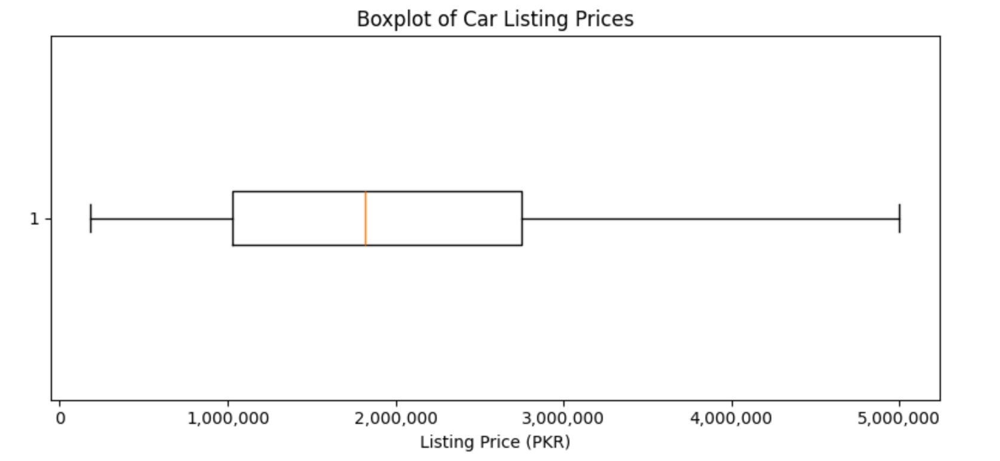
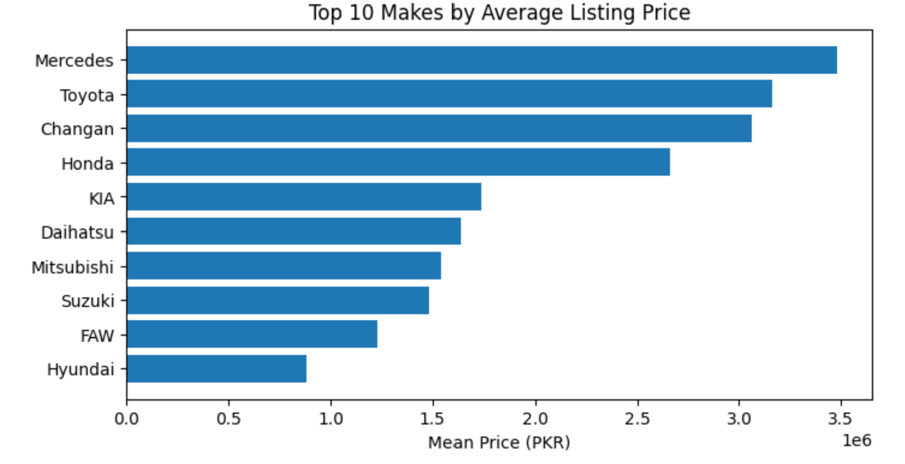
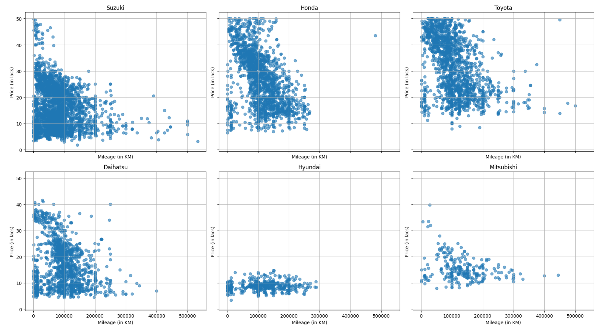
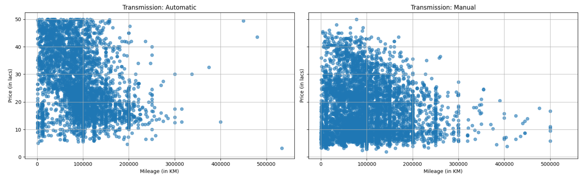
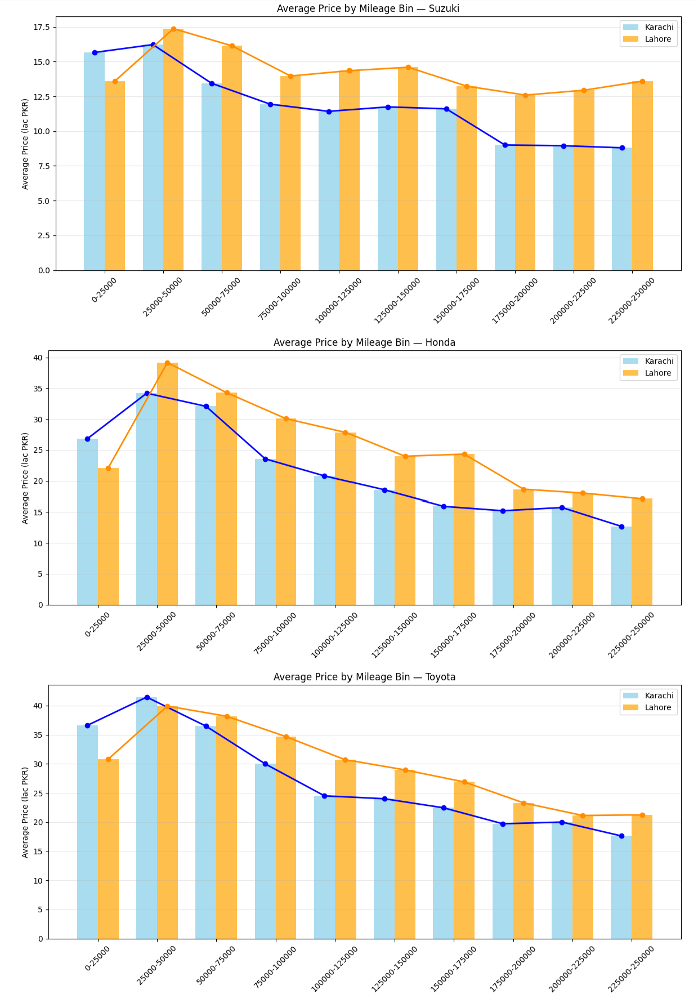
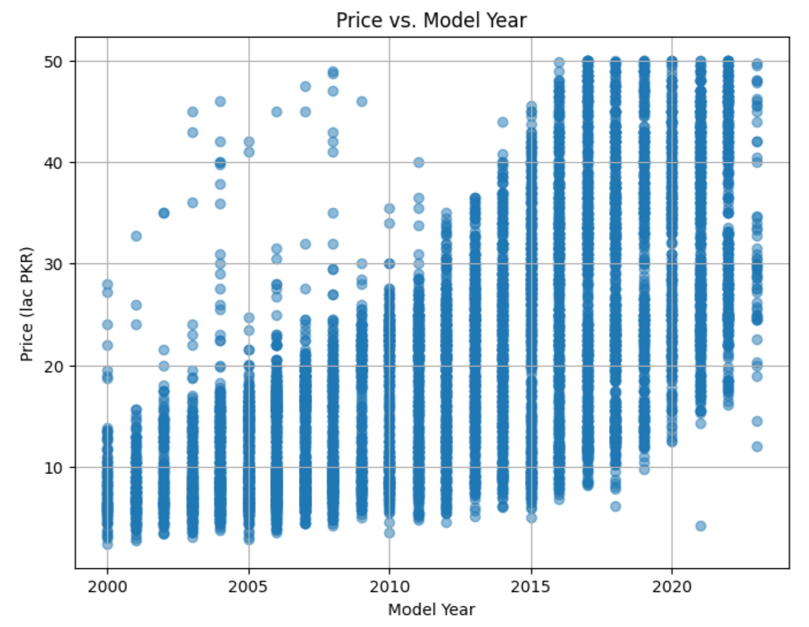
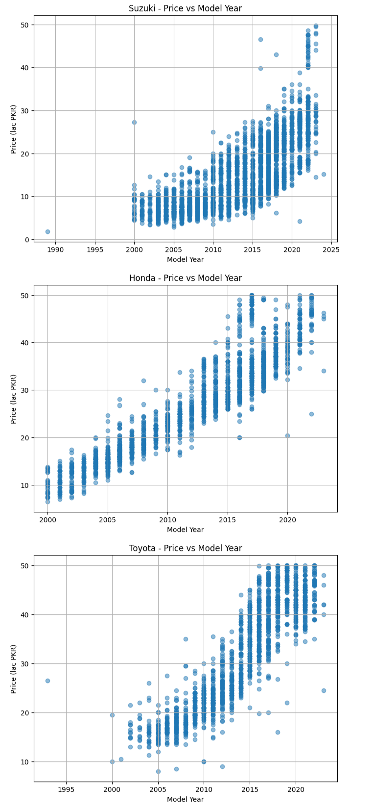
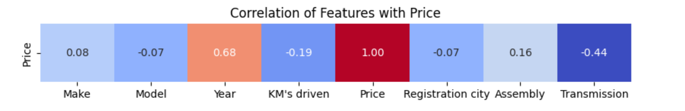
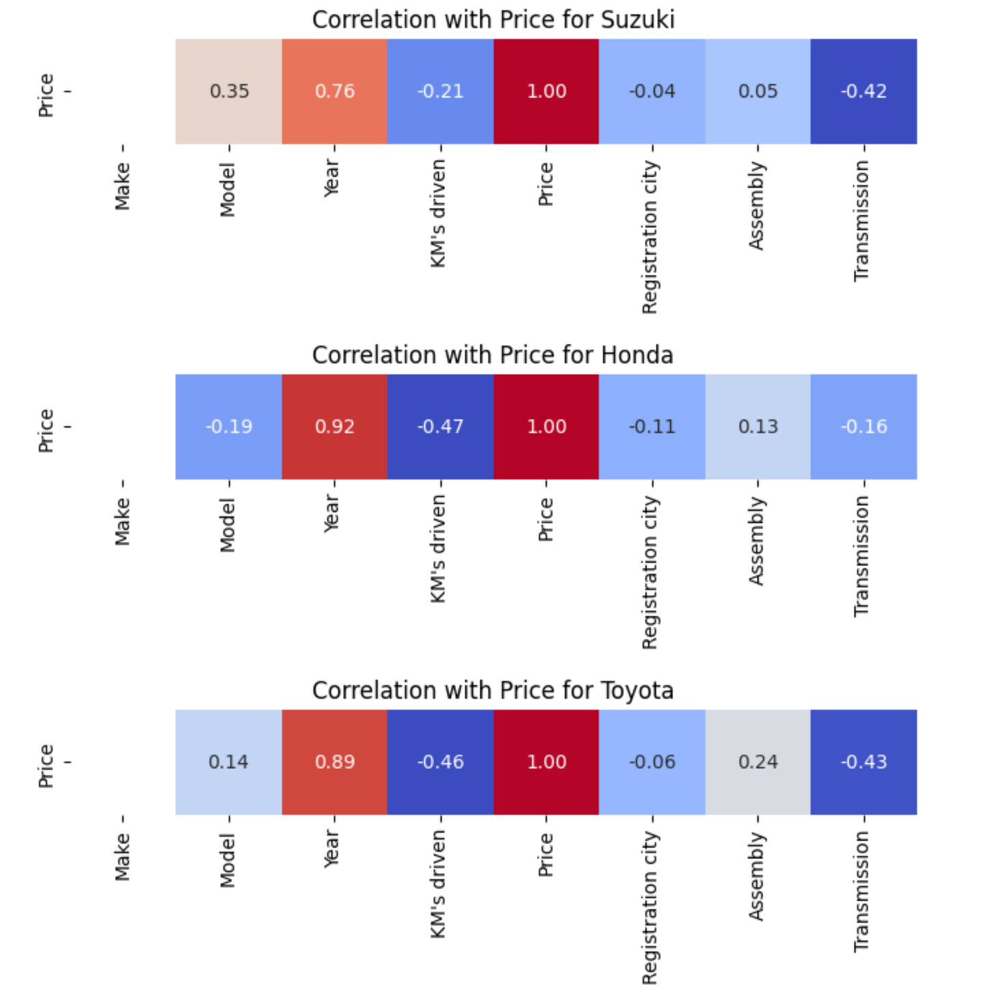

# 🚗 OLX Cars EDA (Pakistan)

Exploratory data analysis of used-car listings from **OLX Pakistan**.  
We examine how **price** varies with **mileage, model year, brand, transmission, and city**, estimate a **break-even mileage** where price drops steepen, and fit a baseline **Random Forest** model.

---

## 🔎 Executive Summary

- **Price spread:** wide and right-skewed; mean > median due to high-end tail.  
- **Mileage effect:** clear negative trend; strongest for **Honda/Toyota**, weaker for smaller brands.  
- **Model year (age):** the **strongest** single driver; newer cars command a steep premium.  
- **City gap:** **Lahore > Karachi** across most mileage bins; gap narrows at very high mileage.  
- **Break-even mileage (slope change):** **≈ 17,161 km** (piecewise linear regression).  
- **Baseline model:** **R² = 0.9507**, **MAPE = 9.64%** ✅ (<10%).

---

## 🧭 Approach

**Data & Cleaning**
- Loaded raw OLX listings; kept `price`, `model_year`, `kms_driven`, `make`, `model`, `transmission`, `city`, `assembly`.
- Removed obvious errors/duplicates and trimmed extreme price outliers (to keep distribution interpretable).

**EDA**
- Distribution: boxplot + brand means to understand spread and mix.
- Relationships:
  - **Price ~ Mileage** (scatter/LOWESS, by brand & transmission).
  - **Price ~ Year** (overall + brand panels).
  - **City** differences across **mileage bins** (Karachi vs Lahore).

**Break-even mileage**
- Fit a **two-segment linear model** on `price ~ mileage` using grid-searched breakpoints (10–90th percentiles) and chose minimum SSE.
- Interpretation: the post-breakpoint slope is markedly more negative → price declines faster beyond this mileage.

**Modeling**
- Encoded categoricals, trained **Random Forest Regressor** on held-out data; reported **R²** and **MAPE**.

---

## 📊 Key Questions & Figures

### 1) What does the overall price distribution look like?
- Median around ~1.8M PKR with a long right tail.  
- Brand mix shows premium tiers (Mercedes/Toyota/Honda higher).




---

### 2) How does mileage impact price?
- Negative relationship overall; slope strength varies by brand.  
- Transmission split shows a **level shift** (automatics higher) but **both** types depreciate with mileage.




**Break-even mileage:** **≈ 17,161 km** — beyond this point, the fitted slope becomes more negative (price declines faster).  

---

### 3) Is there a city effect (Karachi vs Lahore) across mileage?
- Lahore tends to price higher than Karachi across bins; difference shrinks at very high mileage.



---

### 4) How does model year affect price?
- Newer models command substantially higher prices; strongest single driver overall.  
- Brand panels show similar shape with different levels.




---

### 5) Which features matter most?
- Correlations: **Year (+)** strongest; **Mileage (−)** moderate; **Transmission (−)** indicates price tiering.  
- Brand-wise correlations echo the pattern (Honda/Toyota stronger correlation with year/mileage).




---

### 6) Can we predict price reasonably well?
**Random Forest** on held-out data:
- **R²:** `0.9506742203449255`  
- **MAPE:** `0.09638845487934829` (**9.64%**) ✅

Notebook: `06_notebooks/price_pred_randFor.ipynb`

---

### ▶️ How to Run
### 1) Install dependencies  
Run this **from the repo root** (the folder with `README.md` and `requirements.txt`):
```bash
pip install -r requirements.txt
# or
python -m pip install -r requirements.txt
# Windows alternative
py -m pip install -r requirements.txt
```
### 2) Run the notebook files in order
Run the notebook files after downloading the repository in the same format

